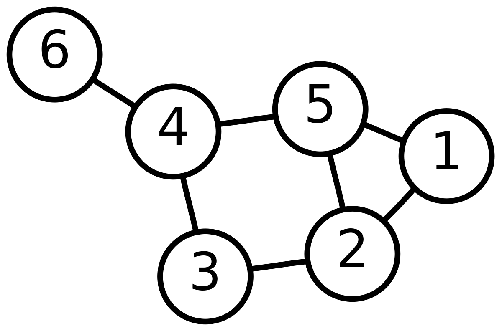

# Algoritmos para resolver problemas de Grafos

## Dijkstra: resolución de problemas de camino mas corto (shortest path)

- El gráfico puede ser de tipo circular o jerárquico (arbol)

- dijkstra_orig_to_allnodes.py: resuelve el shortest path entre el nodo original y cada nodo del grafo e imprime el resultado en consola

- El grafo puede ser dirigido o no dirigido

- Se debe seleccionar nodo origen

- dijkstra_orig_dest.py: resuelve el shortest path entre el nodo original y el nodo final

- Grafica el grafo resultante

- Se deben seleccionar nodo origen y nodo destino

##

## Kruskal: resolución de problemas de Arbol de Expansión Mínima

- arbol_expansion_minima.py: grafica e imprime en consola el AEM y calcula la distancia total
